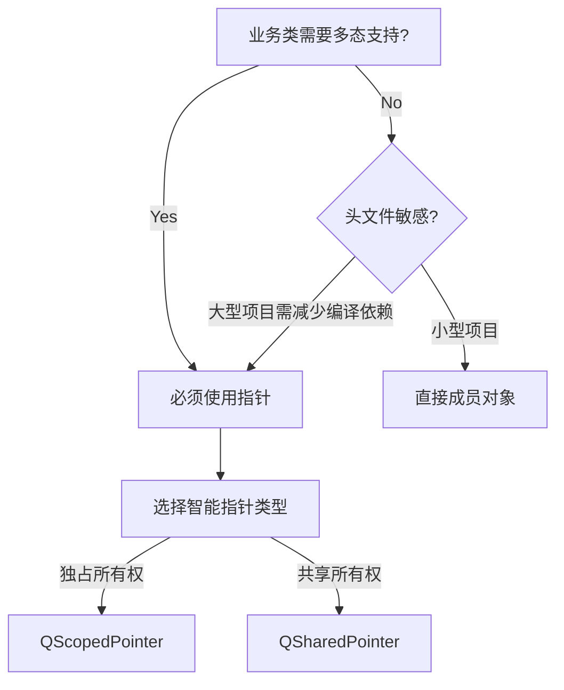

```mermaid
graph TD
    A[业务类需要多态支持?] -->|Yes| B[必须使用指针]
    A -->|No| C{头文件敏感?}
    C -->|大型项目需减少编译依赖| B
    C -->|小型项目| D[直接成员对象]
    B --> E[选择智能指针类型]
    E -->|独占所有权| F[QScopedPointer]
    E -->|共享所有权| G[QSharedPointer]
```

